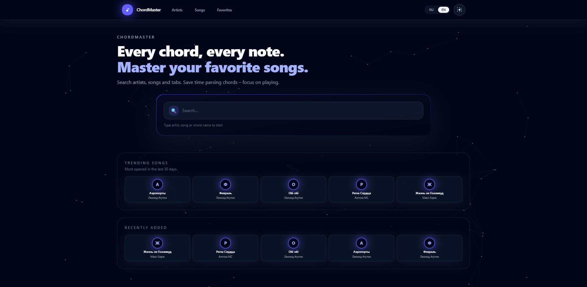

# amdm-guitar-chords

Веб-приложение для просмотра и добавления песен с аккордами и разбором (в духе каталога вроде AmDm): каталог артистов и песен, поиск, транспонирование аккордов, отображение аппликатур, тёмная тема и локализация (RU/EN). Бэкенд — REST API на Go (Chi, GORM, PostgreSQL), фронтенд — React 19 + Vite + TypeScript + Tailwind CSS 4.



Репозиторий — монорепозиторий:

| Каталог | Назначение |
|--------|-------------|
| `back/` | HTTP API, миграции, доменная логика |
| `web/` | SPA (сборка в статику + Nginx в Docker) |
| `ops/` | Вспомогательные shell-скрипты для Docker (бэкап, очистка метрик) |

---

## Возможности

- **Артисты и песни**: списки с пагинацией, карточки, создание через формы (`/artists/new`, `/songs/new`).
- **Контент песни**: структурированный JSON (секции, блоки, последовательности аккордов, табы); на фронте — отображение, аппликатуры из встроенной таблицы и данных песни.
- **Транспонирование**: `POST /songs/{id}/transpose?semitones=...` — сдвиг аккордов и обновление тональности.
- **Поиск**: `GET /search?q=...` по названию песни и имени артиста.
- **Сортировки списка песен**, в том числе по «открытиям» за 30 дней (`opens_30d_desc`) для «трендовых» подборок.
- **«Избранное»**: подписки на артистов и песни хранятся в браузере (не на сервере).
- **Healthcheck**: `GET /healthz` — проверка доступности БД (используется сервисом бэкапа при необходимости).

---

## Требования

- **Docker** и Docker Compose — для полного стека и интеграционных тестов (testcontainers).
- **Go 1.24** — локальная разработка и тесты бэкенда (`back/go.mod`).
- **Node.js ≥ 20.19** — фронтенд (`web/package.json`).

---

## Быстрый старт (Docker)

1. В корне репозитория создайте файл `.env` (он в `.gitignore`). Пример минимального набора:

   ```env
   POSTGRES_USER=amdm
   POSTGRES_PASSWORD=amdm
   POSTGRES_DB=amdm
   SERVER_PORT=8081
   ```

2. Поднимите весь стек (пересборка образов и **сброс тома БД** из-за `-v`):

   ```bash
   make restart
   ```

   Чтобы перезапустить без удаления тома PostgreSQL:

   ```bash
   make restart-srv
   ```

3. Откройте в браузере:

   - **UI**: [http://localhost:8080](http://localhost:8080) (Nginx отдаёт SPA и проксирует API на бэкенд).
   - **API напрямую**: [http://localhost:8081](http://localhost:8081) (префикс маршрутов API: `/api/amdm/v1`).
   - **Prometheus**: [http://localhost:9090](http://localhost:9090) (скрейпит бэкенд по `GET /metrics`).
   - **Grafana**: [http://localhost:3000](http://localhost:3000) (логин/пароль по умолчанию `admin` / `admin`).
   - **Kibana**: [http://localhost:5601](http://localhost:5601) (просмотр логов из Elasticsearch, индекс `amdm-logs-*`).
   - **Проверка метрик**: откройте [http://localhost:8081/metrics](http://localhost:8081/metrics) и убедитесь, что там есть `http_requests_total` и `song_opens_total`.

Сервисы Compose:

- `postgres` — PostgreSQL 16.
- `back` — Go-сервер.
- `web` — Nginx + статика из `web/dist`.
- `prometheus` — метрики бэкенда (скрейпит `GET /metrics`).
- `grafana` — дашборды/аналитика поверх Prometheus.
- `elasticsearch` — хранилище логов.
- `logstash` — pipeline для приёма и обработки логов.
- `kibana` — визуализация и поиск по логам.
- `logspout` — сбор docker-логов через Docker socket и отправка в Logstash (syslog).
- `kibana-setup` — одноразовая автонастройка Kibana (создаёт Data View `amdm-logs-*` и делает его дефолтным).
- `db-backup` — периодические дампы в `./backups` (см. ниже).
- `db-prune-song-opens` — периодическая очистка старых записей об «открытиях» песен (настраивается `SONG_OPENS_*`).

---

## Продакшен-образы

Файл `docker-compose.prod.yml` подтягивает готовые образы с GitHub Container Registry (по умолчанию `ghcr.io/helltale/chord-master-back:latest` и `chord-master-web:latest`). Переопределение владельца образов:

```env
GHCR_OWNER=ваш-org
```

Запуск:

```bash
make deploy-pull
```

или вручную:

```bash
docker compose -f docker-compose.prod.yml pull
docker compose -f docker-compose.prod.yml up -d --remove-orphans
```

> Для ELK в compose включён режим single-node без security (`xpack.security.enabled=false`) для простого локального/стендового запуска.
> В Kibana также отключён interactive setup (`INTERACTIVESETUP_ENABLED=false`), поэтому экран с Enrollment token не должен появляться.

После старта compose сервис `kibana-setup` автоматически выполняет bootstrap Kibana через API, поэтому вручную создавать Data View не нужно.

Проверка автонастройки:

```bash
docker compose logs kibana-setup
```

---

## Локальная разработка без пересборки всего Compose

### База данных

Поднимите только PostgreSQL (или используйте уже запущенный `docker compose` с проброшенным портом `5432`).

### Бэкенд

```bash
cd back
export DB_HOST=localhost DB_PORT=5432 DB_USER=amdm DB_PASSWORD=amdm DB_NAME=amdm SERVER_PORT=8081
go run ./cmd/server
```

Миграции выполняются при старте сервера.

### Фронтенд

```bash
cd web
cp .env.example .env   # при необходимости
npm install
npm run dev
```

По умолчанию клиент ходит на относительный базовый путь **`/api/amdm/v1`** (`web/src/config/env.ts`). В режиме Vite используется прокси для префикса `/api` из `web/vite.config.ts`.

> **Важно:** в `vite.config.ts` цель прокси задана как `http://localhost:8080` (порт **веб-контейнера** в Docker). Если бэкенд запущен **локально** на `8081`, для работы API из `npm run dev` укажите в прокси `http://localhost:8081` либо задайте в `.env` фронта полный URL, например `VITE_API_BASE=http://localhost:8081/api/amdm/v1` (при прямом обращении к другому origin может понадобиться настройка CORS на бэкенде; предпочтительнее корректный прокси на тот же origin, что и dev-сервер).

---

## API и контракт

- Спецификация: [`back/internal/api/openapi.yaml`](back/internal/api/openapi.yaml).
- Базовый путь в рантайме: **`/api/amdm/v1`** (монтируется в [`back/cmd/server/main.go`](back/cmd/server/main.go)).

Генерация кода из OpenAPI:

```bash
make gen-back   # Go: types + chi strict server в back/internal/handler/gen/
make gen-web    # TypeScript-схемы в web/src/api/schemas/
```

---

## Тесты и линтинг

```bash
make test       # unit-тесты Go (все пакеты) + Vitest во front
make utest      # то же явно
make itest      # интеграционные тесты API (тег integration), см. back/tests/
make lint       # golangci-lint в back + ESLint в web
```

Подробности по интеграционным тестам, testcontainers и переменной **`TEST_DATABASE_DSN`**: [`back/tests/README.md`](back/tests/README.md).

---

## Переменные окружения бэкенда

Читаются из env (см. [`back/internal/config/config.go`](back/internal/config/config.go)):

| Переменная | Назначение | По умолчанию |
|------------|------------|---------------|
| `DB_HOST`, `DB_PORT`, `DB_USER`, `DB_PASSWORD`, `DB_NAME` | PostgreSQL | `localhost`, `5432`, `amdm`, … |
| `DB_SSLMODE` | Режим SSL | `disable` |
| `DB_MAX_IDLE_CONNS`, `DB_MAX_OPEN_CONNS` | Пул подключений | `10`, `100` |
| `SERVER_PORT` | HTTP-порт | `8081` |
| `BACKEND_LOG_LEVEL` | Уровень логов | `info` |
| `BACKEND_ENV` | Окружение | `development` |
| `SERVER_READ_TIMEOUT_SEC`, `SERVER_WRITE_TIMEOUT_SEC`, `SERVER_IDLE_TIMEOUT_SEC` | Таймауты HTTP | `15`, `15`, `60` |

Фронт: `VITE_API_BASE` — база API (пусто → `/api/amdm/v1`).

---

## Сборка бэкенда с корпоративным CA

В [`back/Dockerfile`](back/Dockerfile) поддерживается секрет `corp_ca` для доверенного корневого сертификата при `go mod download` за прокси:

```bash
docker compose build --secret id=corp_ca,src=$HOME/corp-root.pem
```

---

## Бэкапы PostgreSQL

В Compose включён сервис **`db-backup`**: периодически сохраняет дампы в каталог **`backups/`**, ротация FIFO (число файлов настраивается).

| Действие | Команда |
|----------|---------|
| Ручной бэкап | `make backup` |
| Восстановление | `make restore BACKUP_FILE=backups/<имя>.sql.gz` |
| Фоновые автобэкапы | `docker compose up -d db-backup` |

Переменные сервиса `db-backup` (имеют значения по умолчанию в `docker-compose.yml`):

- **`BACKUP_INTERVAL_SEC`** — интервал между дампами (по умолчанию `21600`, 6 часов).
- **`BACKUP_KEEP`** — сколько последних файлов хранить (по умолчанию `10`).
- **`BACKUP_WAIT_TIMEOUT_SEC`** — ожидание готовности БД перед дампом (по умолчанию `60` с).
- **`BACKUP_CHECK_BACKEND_HEALTH`** — опционально проверять `GET /healthz` у бэкенда (`false` по умолчанию).
- **`BACKEND_HEALTH_URL`** — URL health endpoint (по умолчанию `http://back:8081/healthz`).

Перед дампом выполняются проверки `pg_isready` / `SELECT 1` и при включённой опции — запрос к **`/healthz`**, чтобы не архивировать БД в явно «больном» состоянии приложения.

Локальная ротация на одном сервере **не заменяет** off-site копирование; имеет смысл выгружать `backups/` во внешнее хранилище или на отдельный хост.

---

## Прочие цели Makefile

| Цель | Описание |
|------|----------|
| `make docker-build` | Сборка образов с `--no-cache` |
| `make tidy` | `go mod tidy` в `back/` |

---

## Лицензия

В репозитории файл лицензии не указан; уточните условия использования у автора.
